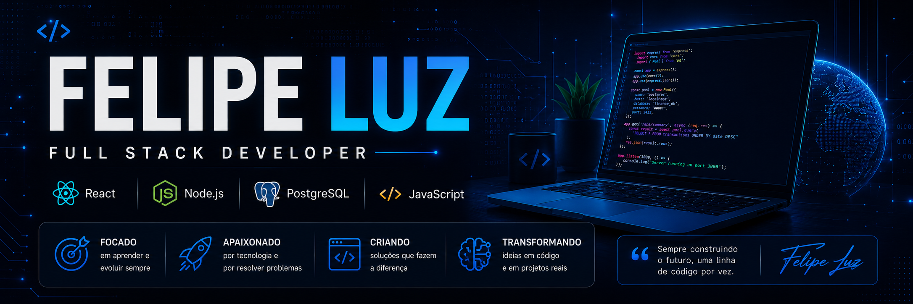

<p align="center">
  
</p>

# 👋 Olá, eu sou Felipe Luz

### 💻 Desenvolvedor Full Stack em formação

[](https://github.com/felipesilv0607-lab)

Sou estudante de **Análise e Desenvolvimento de Sistemas (ADS)** e estou construindo minha trajetória na área de desenvolvimento de software.

Meu foco atual é o desenvolvimento Web e Full Stack, principalmente com **JavaScript, React, Node.js, Express, PostgreSQL e Prisma**, transformando o conhecimento adquirido nos estudos em projetos e aplicações reais.

> 🚀 **Meu objetivo é evoluir através de projetos práticos e conquistar minha primeira oportunidade profissional na área de tecnologia.**

---

## 🧑‍💻 Sobre mim

🎓 Estudante de **Análise e Desenvolvimento de Sistemas**

💻 Focado em **Desenvolvimento Web e Full Stack**

⚛️ Desenvolvendo aplicações com **React e JavaScript**

🟢 Construindo APIs com **Node.js e Express**

🗄️ Trabalhando com **SQL, PostgreSQL e Prisma**

🔧 Utilizando **Git e GitHub** no desenvolvimento dos meus projetos

📚 Buscando constantemente evoluir em programação e boas práticas

🤖 Utilizando **IA como ferramenta de apoio** para pesquisa, aprendizado, depuração e desenvolvimento

🎯 Buscando minha **primeira oportunidade profissional em Tecnologia**

---

# 🛠️ Tecnologias & Ferramentas

## 🌐 Front-end


---

## ⚙️ Back-end e Banco de Dados


---

## 🔧 Ferramentas


---

## 🤖 Inteligência Artificial


> Utilizo ferramentas de IA como apoio para **pesquisa, aprendizado, depuração, documentação e desenvolvimento**, sempre buscando compreender e validar as soluções utilizadas.

---

# 🚀 Projetos em destaque

## 🌤️ Weather App

Aplicação de previsão do tempo desenvolvida para praticar **JavaScript, consumo de APIs e integração entre Front-end e Back-end**.

### 🛠️ Tecnologias

`HTML` `CSS` `JavaScript` `Node.js` `Express` `OpenWeather API`

🌐 **[Ver aplicação](https://felipesilv0607-lab.github.io/weather-app/)**

💻 **[Ver código](https://github.com/felipesilv0607-lab/weather-app)**

---

## 💰 Sistema Financeiro

Aplicação **Full Stack** para gerenciamento de receitas e despesas, com foco em organização financeira e visualização de dados.

### 🛠️ Tecnologias

`React` `Vite` `Node.js` `Express` `PostgreSQL` `Prisma`

### 📌 Principais objetivos

- Gerenciamento de receitas e despesas
- Integração entre Front-end e Back-end
- Persistência de dados com PostgreSQL
- Utilização do Prisma como ORM
- Desenvolvimento de APIs REST
- Organização de uma arquitetura Full Stack

**Status:** 🚧 Em desenvolvimento

> Projeto utilizado para aprofundar conhecimentos em **React, APIs, banco de dados, Prisma e arquitetura Full Stack**.

💻 **[Ver código](https://github.com/felipesilv0607-lab/finance-system)**

---

## 💼 Portfólio

Meu portfólio pessoal desenvolvido para apresentar minha trajetória, projetos, tecnologias e experiências como desenvolvedor.

### 🛠️ Tecnologias

`React` `Vite` `JavaScript` `CSS`

**Status:** 🚧 Em evolução

🌐 **[Ver portfólio](https://felipesilv0607-lab.github.io/portfolio/)**

💻 **[Ver código](https://github.com/felipesilv0607-lab/portfolio)**

---

# 📂 Meus repositórios

[](https://github.com/felipesilv0607-lab/weather-app)

[](https://github.com/felipesilv0607-lab/freecodecamp-javascript)

[](https://github.com/felipesilv0607-lab/portfolio)

[](https://github.com/felipesilv0607-lab/finance-system)

---

# 📊 Minha atividade no GitHub


### 🌊 Histórico de contribuições

Os gráficos acima representam minha atividade e evolução no GitHub ao longo do tempo.

> Cada contribuição representa uma etapa da minha evolução como desenvolvedor.

---

# 🐍 Minhas contribuições


---

---

# 🧭 Minha jornada

```text
HTML + CSS
     │
     ▼
JavaScript
     │
     ▼
Git & GitHub
     │
     ▼
React
     │
     ▼
Node.js + Express
     │
     ▼
SQL + PostgreSQL
     │
     ▼
Prisma
     │
     ▼
Full Stack 🚀
```

---

# 🎯 Atualmente

```text
📚 Estudando
   └── JavaScript • React • Node.js • PostgreSQL

💻 Desenvolvendo
   └── Projetos Full Stack

🔐 Aprendendo
   └── APIs • Autenticação • Banco de dados

🚀 Projeto principal
   └── Sistema Financeiro Full Stack

🎯 Objetivo
   └── Atuar profissionalmente como Desenvolvedor Full Stack
```

---

# 🌎 Objetivo profissional

Busco uma oportunidade na área de tecnologia onde eu possa aplicar meus conhecimentos, aprender com profissionais experientes e participar do desenvolvimento de soluções reais.

Tenho interesse principalmente em oportunidades de **estágio e início de carreira em desenvolvimento de software**, com foco em **Desenvolvimento Web e Full Stack**.

Quero construir minha carreira através de **projetos, aprendizado contínuo e experiências práticas**, evoluindo gradualmente até me tornar um desenvolvedor Full Stack completo.

> 💡 **Estou em busca de uma oportunidade onde eu possa aprender, contribuir e crescer junto com a equipe.**

---

# 📫 Vamos conversar?

[](https://github.com/felipesilv0607-lab)

[](mailto:felipesv0607@gmail.com)

---

### 💻 Programe. Aprenda. Construa. Repita. 🚀

Obrigado por visitar meu perfil!

<p align="center">
  <strong>🚀 Em constante evolução como desenvolvedor.</strong>
</p>
