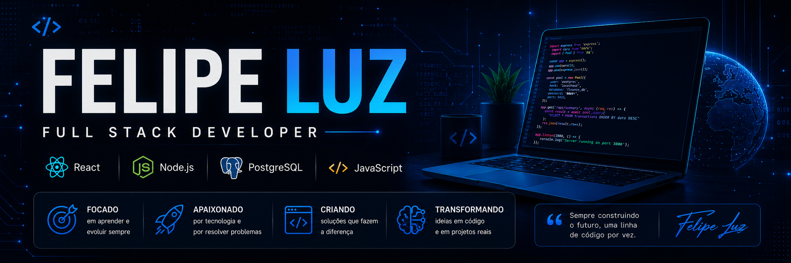

  

# 👋 Olá, eu sou Felipe Luz

### 💻 Desenvolvedor Full Stack

Desenvolvedor focado na construção de aplicações Web e Full Stack, utilizando JavaScript, React, Node.js e PostgreSQL.

Tenho desenvolvido projetos próprios para aplicar conhecimentos de desenvolvimento Front-end, Back-end, APIs REST, bancos de dados, autenticação e integração entre aplicações.

---

## 🛠️ Tecnologias

### Front-end

`JavaScript` `React` `HTML` `CSS` `Vite`

### Back-end

`Node.js` `Express` `REST APIs`

### Banco de Dados

`PostgreSQL` `SQL` `Prisma`

### Ferramentas

`Git` `GitHub` `VS Code`

---

# 🚀 Projetos

## 💰 Finance System

Sistema financeiro Full Stack desenvolvido para gerenciamento de receitas, despesas, contas, categorias e transações.

### Tecnologias

`React` `Vite` `Node.js` `Express` `PostgreSQL` `Prisma`

### Funcionalidades

* Autenticação e autorização de usuários
* Gerenciamento de contas
* Cadastro e gerenciamento de categorias
* Gerenciamento de receitas e despesas
* APIs REST
* Persistência de dados com PostgreSQL
* Integração entre Front-end e Back-end
* Autorização baseada no usuário autenticado

🔗 **[Ver código](https://github.com/felipesilv0607-lab/finance-system)**

---

## 🌤️ Weather App

Aplicação de previsão do tempo desenvolvida para trabalhar com consumo de APIs e integração entre Front-end e Back-end.

### Tecnologias

`HTML` `CSS` `JavaScript` `Node.js` `Express` `OpenWeather API`

🌐 **[Ver aplicação](https://felipesilv0607-lab.github.io/weather-app/)**

💻 **[Ver código](https://github.com/felipesilv0607-lab/weather-app)**

---

## 💼 Portfolio

Portfólio pessoal desenvolvido para apresentar meus projetos, tecnologias e trajetória como desenvolvedor.

### Tecnologias

`React` `Vite` `JavaScript` `CSS`

🌐 **[Ver portfólio](https://felipesilv0607-lab.github.io/portfolio/)**

💻 **[Ver código](https://github.com/felipesilv0607-lab/portfolio)**

---

# 📚 Atualmente

* Desenvolvendo projetos Full Stack
* Aprofundando conhecimentos em React e Node.js
* Trabalhando com APIs REST e PostgreSQL
* Estudando boas práticas de desenvolvimento e arquitetura de aplicações
* Explorando fundamentos de Linux e Cloud

---

# 📫 Contato

💼 **LinkedIn:** [Felipe Luz](https://www.linkedin.com/)

💻 **GitHub:** [felipesilv0607-lab](https://github.com/felipesilv0607-lab)

📧 **E-mail:** [felipesv0607@gmail.com](mailto:felipesv0607@gmail.com)

---

### 🚀 Construindo, aprendendo e evoluindo através de projetos reais.
